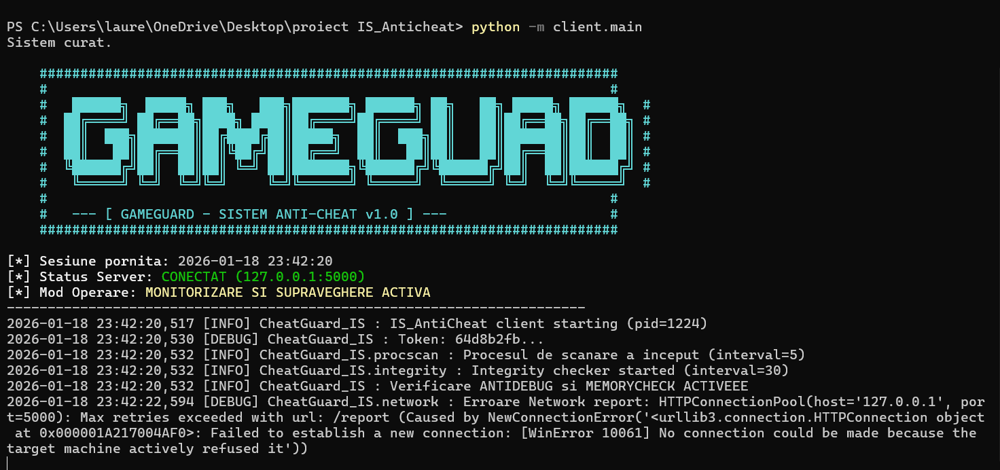

# 🛡️ GameGuard - Advanced Anti-Cheat Solution

A lightweight, modular anti-cheat system designed to monitor, detect, and prevent common game manipulation techniques and memory tampering.

## 🌟 Key Features

### 🔍 Detection Engine
* **Signature-Based Scanning:** Scans active processes against a database of known cheat tools (Cheat Engine, ReClass, etc.).
* **Heuristic Analysis:** Detects suspicious patterns and unauthorized memory modifications.

### 🛡️ Protection Layers
* **Anti-Debugging:** Implements multiple checks (`IsDebuggerPresent`, `CheckRemoteDebuggerPresent`) and timing checks to prevent reverse engineering.
* **DLL Injection Prevention:** Monitors for external module injection and unauthorized thread creation.
* **Integrity Checks:** Uses hashing (CRC32/SHA) to verify that the game's executable code has not been patched in memory.
* **Heartbeat System:** Periodically validates that the anti-cheat service is still active and hasn't been suspended.
